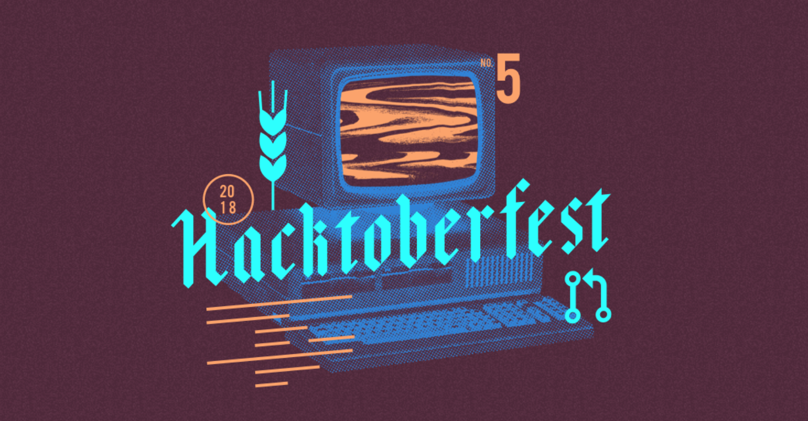
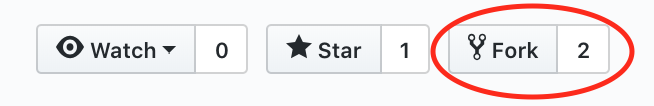

# Hacktoberfest-Python [](https://github.com/shawnkoon/hacktoberfest-python/blob/master/LICENSE) [](https://github.com/shawnkoon/hacktoberfest-python/issues) [](https://github.com/shawnkoon/hacktoberfest-python/network)

Repository for people to contribute python code freely! Anyone is welcome to contribute. Checkout the `Issues` tab for possible ideas :)

Get Hackin!





# What is Hacktoberfest?

Type of hackathon hosted by GitHub, DigitalOcean, and Twilio. You need to create certain number of PR (Pull Requests) within a time frame (October) to receive goodies.

> To get a shirt, you must make five pull requests (PRs) between October 1–31 in any timezone. PRs can be to any public repo on GitHub, not just the ones highlighted. The PR must contain commits you made yourself. PRs reported by maintainers as spam or that are automated will be marked as invalid and won’t count towards the shirt. This year, the first 50,000 of you can earn a T-shirt (compared with 30,000 in 2017).

More information about this can be found [here](https://hacktoberfest.digitalocean.com/faq).

# How to Contribute

> If you're new to open source (which everyone was once!), you can take a look at the Introduction to [Open Source tutorial](https://www.digitalocean.com/community/tutorial_series/an-introduction-to-open-source) series.

> To make your first contribution, it's required to familiarize yourself with [How To Create a Pull Request](https://www.digitalocean.com/community/tutorials/how-to-create-a-pull-request-on-github).

Essentially,

1. **Fork** this repository to your Profile.



2. Clone and create your branch off of **Forked** respository.

```bash
# Clone the repository
$ git clone https://github.com/<your_profile>/hacktoberfest-python.git

# Navigate into the folder
$ cd hacktoberfest-python

# Create new branch off of master branch
hacktoberfest-python $ git checkout -b <branch_name>

# Push newly created branch up into GitHub
hacktoberfest-python $ git push --set-upstream origin <branch_name>
```

3. **Make changes**, then upload it up into your GitHub branch.

```bash
# Check the status of updated files
hacktoberfest-python $ git status

# Add all of the changes you've made
hacktoberfest-python $ git add -A

# Commit your changes with a message
hacktoberfest-python $ git commit -m "Updated blablabla"

# Push your commit up into GitHub
hacktoberfest-python $ git push
```

4. Create Pull Request!
  - `New Pull Request` button should be under `Pull Requests` tab in GitHub UI.
